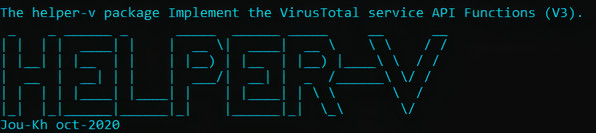

VirusTotal API3 


 
## Installation

```python3
pip3 install vtapi3
pip3 install requests
```

Before using the package from the command line, you must create an environment variable `[vt_api_key]` in which to place the value of the access key to the VirusTotal API functions

## Usage
###### Code

  ....
    try:
        vt_files = vtapi3.VirusTotalAPIFiles(api_key)
        result = vt_files.get_report(hash_id)
        if vt_files.get_last_http_error() == vt_files.HTTP_OK:
            result = json.loads(result)
            cat = result['data']['attributes']["last_analysis_stats"]['malicious']
            if cat > 0:
               result = 'Hash is Malicious'
    ....
```
###### Example
`python3 helper-v.py -hr 033bd94b1168d7e4f0d644c3c95e35bf`
###### Output
```
Analysis report: Hash is Malicious
```
### Positional arguments
* `resource` - Object that you want to analyse in VirusTotal (Hash, URL, IP address, Domain).
### Optional arguments
* `[-h]`, `[--help]` - Show help message and exit
* `[-hr]`, `[--hash-report]` - Getting a report on the results of analyzing a file by its hash (SHA256, SHA1 or MD5).
* `[-usr]`, `[--url-scan-report]` - Getting a report on the results of scanning a URL.
* `[-ipr]`, `[--ip-report]` - Getting a report on the results of IP address analysis.
* `[-dr]`, `[--domain-report]` - Getting a report on the results of domain analysis.
